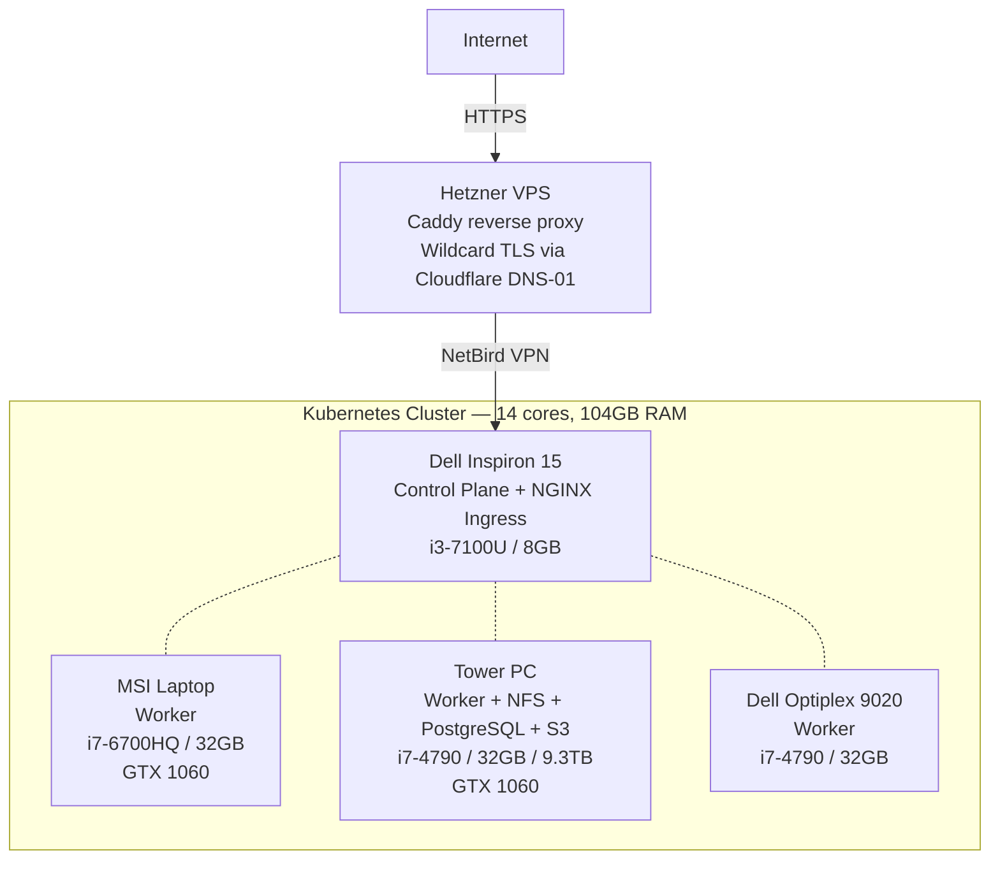

# Home Lab Infrastructure

Bare-metal Kubernetes cluster on repurposed hardware, fully managed through Infrastructure as Code. Four physical machines connected via mesh VPN to a cloud proxy, providing a self-hosted platform for deploying web applications, databases, and CI/CD pipelines.

The goal: push code to any repository in the org and have it built, tested, and deployed automatically — no external CI/CD service, no managed Kubernetes, no cloud vendor runtime costs.

## Architecture



Traffic enters through a Hetzner VPS running Caddy, which terminates TLS with wildcard certificates (Let's Encrypt, DNS-01 via Cloudflare) and forwards requests over a NetBird VPN tunnel to the control plane node. The NGINX Ingress Controller on the control plane handles routing to the appropriate service across the cluster. No ports are opened on the home network.

## CI/CD and Deployment

A new web application can go from an empty repository to live at `*.bearflinn.com` with valid TLS in under 20 minutes. No manual server configuration, no DNS changes, no certificate provisioning — the infrastructure handles all of it.

This works because several layers are already in place:

- **Wildcard TLS** — Caddy on the VPS holds a wildcard certificate for `*.bearflinn.com` via Cloudflare DNS-01, so any new subdomain is covered immediately.
- **Ingress routing** — Adding a Kubernetes Ingress resource with a hostname is enough to route traffic to a new service. The NGINX Ingress Controller picks it up automatically.
- **Private registry** — A container registry runs inside the cluster. Images never leave the local network.
- **Self-hosted runners** — GitHub Actions runners run in the cluster with Docker-in-Docker, Helm, and kubectl pre-installed. They have cluster-scoped RBAC and direct access to the registry.

To deploy a new application, a repository needs three things: a Dockerfile, a Helm chart, and a workflow file.

```yaml
# .github/workflows/deploy.yml
jobs:
  build-and-deploy:
    runs-on: [self-hosted, kubernetes, lab]
    steps:
      - uses: actions/checkout@v4
      - run: docker build -t 10.0.0.226:32346/my-app:${{ github.sha }} .
      - run: docker push 10.0.0.226:32346/my-app:${{ github.sha }}
      - run: helm upgrade --install my-app ./helm --set image.tag=${{ github.sha }} --wait
```

The Helm chart defines the Deployment, Service, and Ingress. A minimal Ingress resource pointing at `myapp.bearflinn.com` is all that's needed to make the application reachable from the internet. After the first push, every subsequent push to main builds, pushes, and deploys automatically.

The runner image also includes Rust (with aarch64 cross-compilation targets), Node.js, and the GitHub CLI, so non-web projects — CLI tools, libraries, cross-compiled binaries — use the same runner infrastructure for builds and tests.

Runner capacity scales from 1 to 10 replicas via Horizontal Pod Autoscaler based on workflow demand.

## Configuration Management

Every machine in the cluster is configured through Ansible — from initial OS setup through Kubernetes installation to application deployment. The playbooks are designed to run in sequence for a fresh cluster or individually for maintenance.

**Cluster provisioning** (run once for a new cluster):
1. `baseline-setup.yml` — Static IPs, hostnames, DNS, system packages
2. `setup-control-plane.yml` — kubeadm init, Calico CNI (dual-stack IPv4/IPv6)
3. `setup-workers.yml` — Node join, labeling by workload role
4. `k8s-verify.yml` — Automated health validation

**Infrastructure services** (idempotent, safe to re-run):
- `setup-proxy-vps.yml` — Caddy reverse proxy, UFW, fail2ban
- `tower-storage-setup.yml` — ZFS pool, NFS exports, bcache
- `setup-postgresql.yml` — PostgreSQL with TLS, automated backups, pgvector
- `setup-garage.yml` — S3-compatible object storage on ZFS RAID-Z1

Secrets are encrypted with Ansible Vault. A single `.vault_pass` file (git-ignored) unlocks everything.

### Ansible Roles

| Role | Responsibility |
|------|---------------|
| `k8s-prerequisites` | Kernel modules, sysctl, containerd, CNI plugins |
| `k8s-packages` | kubeadm/kubelet/kubectl with version pinning |
| `k8s-control-plane` | Cluster init, Calico, dual-stack networking |
| `k8s-worker` | Node join, readiness verification, labeling |
| `caddy` | Reverse proxy with optional Cloudflare DNS plugin |
| `postgresql-server` | Containerized PostgreSQL with TLS, backups, pgvector |
| `garage-server` | S3-compatible storage on ZFS with resource isolation |
| `tower-storage-setup` | ZFS RAID-Z1, NFS server, bcache caching layer |

## Storage

The Tower PC serves as the storage backbone:

- **Block storage (NFS):** Dynamic provisioning for Kubernetes PVCs via nfs-subdir-external-provisioner. Application pods request storage through standard PersistentVolumeClaims and get NFS-backed volumes automatically.
- **Object storage (Garage):** S3-compatible API running on a ZFS RAID-Z1 pool across 3x2TB HDDs (~4TB usable). Available for application assets, backups, and any workload that speaks S3.
- **Database (PostgreSQL):** Runs on the Tower PC with TLS client certificates, daily automated backups via cron, and the pgvector extension for vector operations. Exposed to the cluster as a Kubernetes ExternalName service.

## Networking

- **CNI:** Calico with dual-stack IPv4 + IPv6 and BGP mesh between nodes
- **Ingress:** NGINX Ingress Controller on NodePorts (HTTP 30487, HTTPS 30356)
- **VPN:** NetBird mesh connecting all nodes and the VPS proxy
- **Firewall:** nftables rules managed by Ansible, with specific rules to allow NetBird-to-NodePort forwarding
- **DNS/TLS:** Wildcard certificates via cert-manager and Cloudflare DNS-01 challenges

The Calico IP autodetection is configured to prefer the LAN interface over VPN tunnels (`can-reach=8.8.8.8`), which avoids a common bare-metal pitfall where BGP peers over the wrong interface.

## Deployed Services

Applications are managed in their own repositories, each with a Helm chart and GitHub Actions workflow:

| Service | Stack |
|---------|-------|
| Portfolio landing page | Static site |
| Interactive resume | Full-stack with PostgreSQL + pgvector |
| Coaching website | Full-stack with PostgreSQL |
| Family dashboard | Full-stack with Infisical secrets management |

## Repository Structure

```
ansible/
  inventory/         Host definitions (cluster nodes, VPS)
  group_vars/        Shared variables and vault-encrypted secrets
  playbooks/         14 playbooks covering full cluster lifecycle
  roles/             8 reusable roles
  templates/         Jinja2 configs (Caddyfile, PostgreSQL, Garage, systemd)

kubernetes/
  base/              Kustomize root (registry, runner, postgresql, garage)
  github-runner/     Runner deployment, RBAC, autoscaler, Docker daemon config
  registry/          Private container registry (deployment, service, PVC)
  ingress-nginx/     Helm values for NGINX Ingress Controller
  nfs-provisioner/   Helm values for NFS dynamic provisioner

docker/
  github-runner/     Custom runner image (Rust, Helm, kubectl, Node.js, cross-compile)

scripts/             Idempotent shell scripts for Helm installs and node configuration
docs/                Architecture decisions, deployment guide, operational runbooks
```

## Getting Started

### Provision a new cluster from scratch

```bash
# All playbooks decrypt secrets via .vault_pass (git-ignored)
ansible-playbook -i ansible/inventory/all-nodes.yml ansible/playbooks/baseline-setup.yml -v
ansible-playbook -i ansible/inventory/all-nodes.yml ansible/playbooks/setup-control-plane.yml -v
ansible-playbook -i ansible/inventory/all-nodes.yml ansible/playbooks/setup-workers.yml -v
ansible-playbook -i ansible/inventory/all-nodes.yml ansible/playbooks/k8s-verify.yml -v

# Install cluster addons
./scripts/install-cert-manager.sh
./scripts/install-ingress-nginx.sh
./scripts/install-nfs-provisioner.sh
./scripts/install-github-runner.sh
```

### Deploy a new application

1. Add a `Dockerfile` and `helm/` chart to the application repository
2. Add the GitHub Actions workflow targeting `[self-hosted, kubernetes, lab]`
3. Push to main

The runner builds the image, pushes it to the private registry, and deploys via Helm.

## Documentation

| Document | Contents |
|----------|----------|
| [docs/ARCHITECTURE.md](docs/ARCHITECTURE.md) | Node specs, network topology, technology decisions |
| [docs/DEPLOYMENT.md](docs/DEPLOYMENT.md) | Deployment patterns, secrets management, registry operations |
| [docs/RUNBOOKS.md](docs/RUNBOOKS.md) | Troubleshooting procedures, recovery steps, health checks |

## License

MIT
